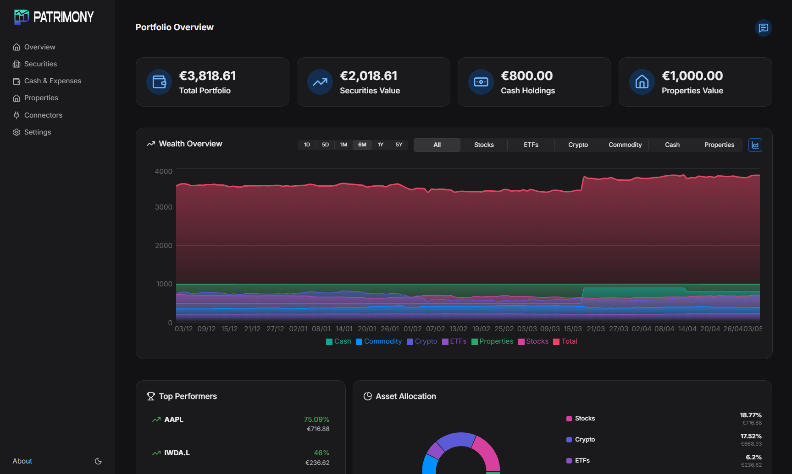
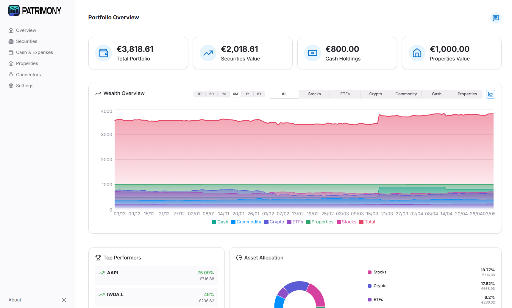
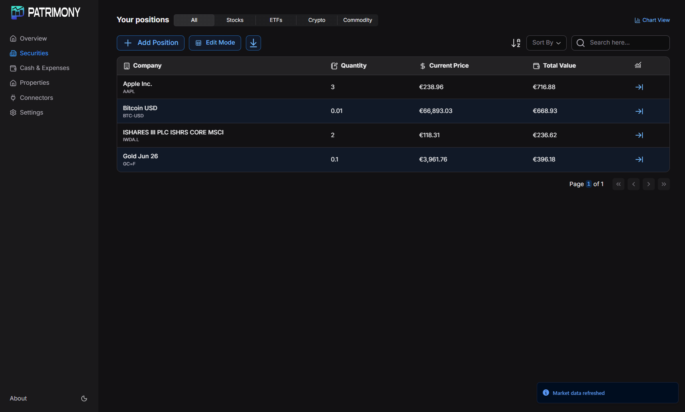
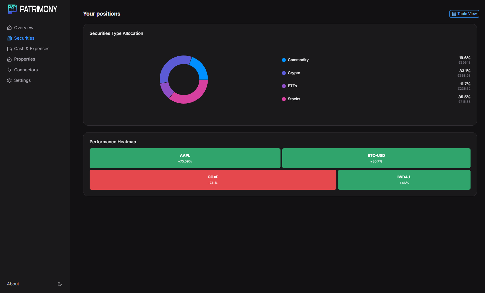
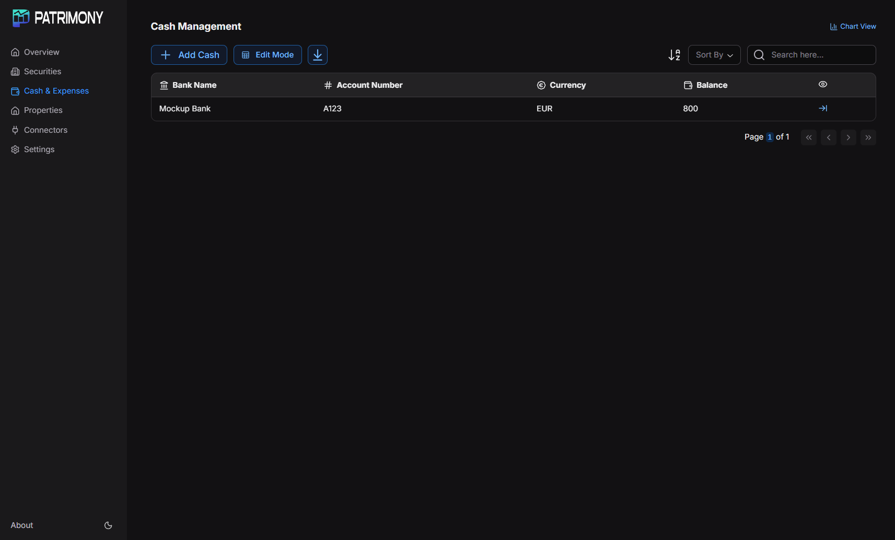
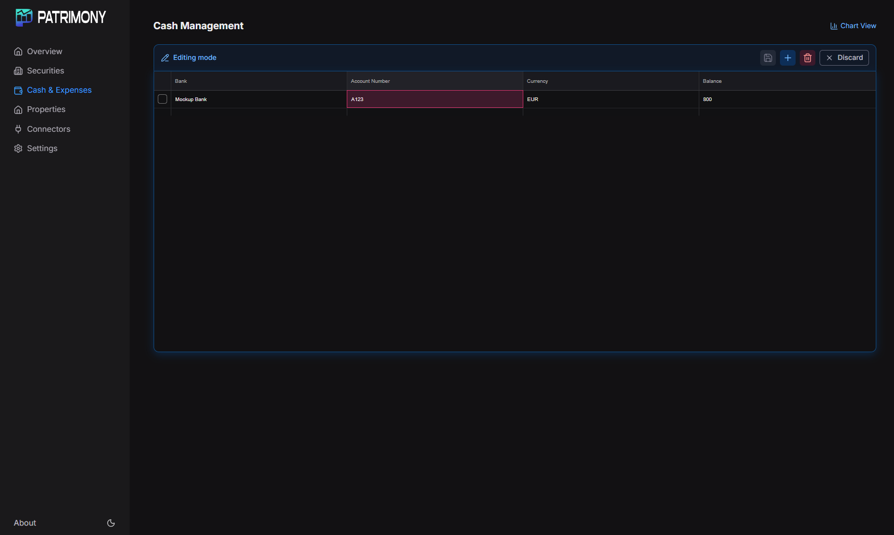
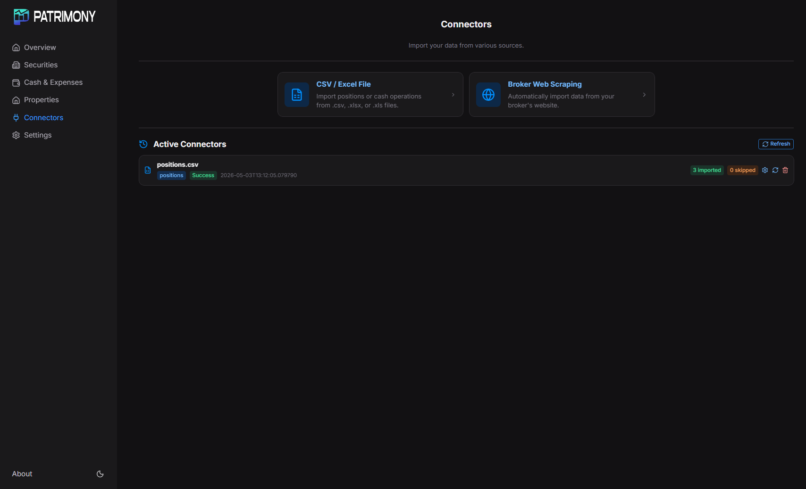
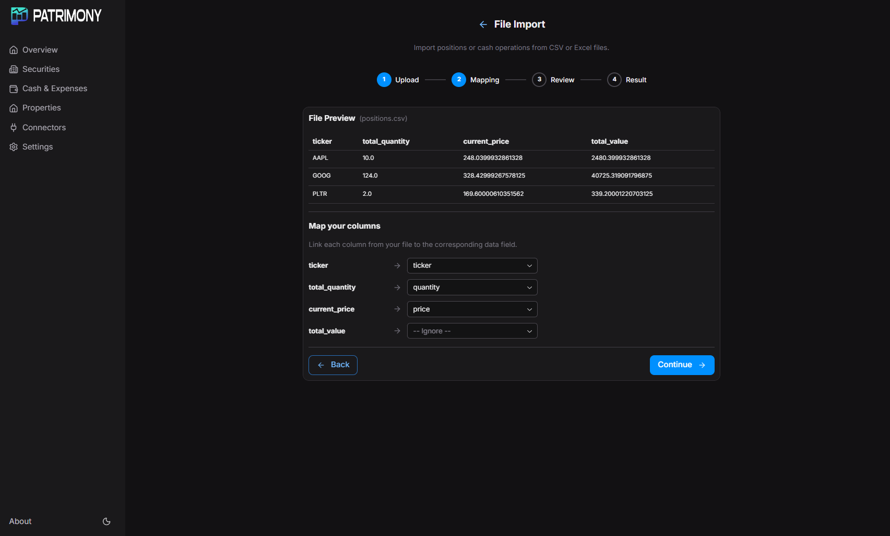
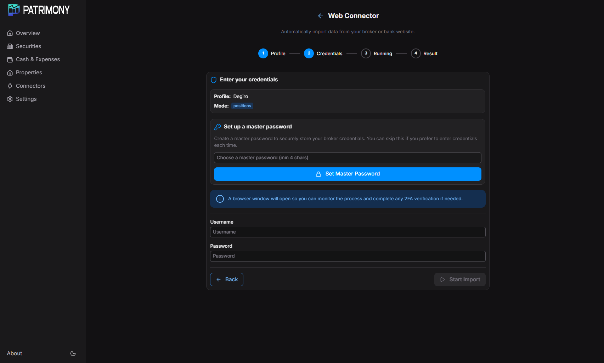
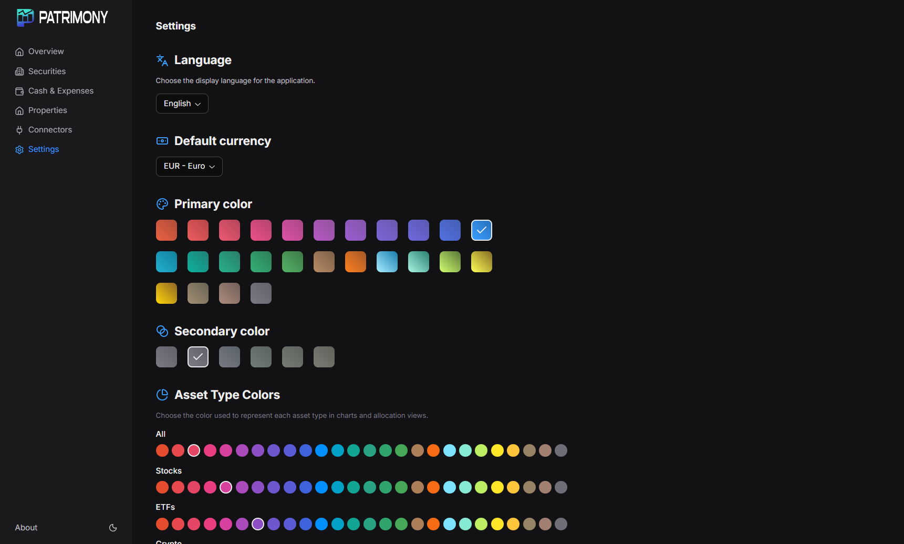

# Patrimony

An open-source personal wealth tracking desktop application built with **Reflex** (Python) and **Tauri** (Rust).

## Features

- **Securities tracking** – Add stock, ETF, crypto and commodity positions manually or via file import (CSV/Excel). Aggregated view with current prices, allocation charts and heatmap.
- **Cash accounts** – Track bank accounts with balance operations, monthly income/expense charts and category breakdowns.
- **Portfolio overview** – Unified dashboard with total wealth, performance KPIs, wealth chart, top/bottom performers and dividend summary.
- **File connectors** – Import positions or cash operations from CSV/Excel files with a column-mapping wizard. Automatic duplicate detection via row hashing.
- **Web connectors** – Automated browser-based import from broker/bank websites using Playwright with profile-based automation steps.
- **Multi-currency** – All values converted to a user-selected display currency via live exchange rates.
- **Market data** – Live and historical prices from Yahoo Finance with local DuckDB cache (15-min TTL for current prices, smart gap-fill for history).
- **Credential vault** – Encrypted storage for web connector credentials (PBKDF2 + Fernet), unlockable with a master password.
- **Internationalisation** – English, French and Spanish locale files.
- **Dark/light theme** – Configurable accent and asset-type colours.

## Architecture

```
patrimony/
├─ backend/               # Pure Python business logic
│  ├─ di_container.py     # Dependency-injector DI container (wires all layers)
│  ├─ config/             # Backend logging configuration
│  ├─ domain/             # Entities, repository ABCs, domain services
│  │  ├─ repositories/    # Abstract repository contracts (asset & support)
│  │  └─ services/        # Portfolio, securities, cash, currency, price, …
│  │     └─ connectors/   # File & web connector domain services
│  ├─ infrastructure/     # Concrete implementations
│  │  ├─ database/        # DuckDB connection, DDL, reference data
│  │  ├─ integrations/    # yfinance provider, file reader, Playwright connectors
│  │  │  └─ web_connector/# Broker-specific scripts (Degiro, Revolut, TR, …)
│  │  └─ repositories/    # All repository implementations
│  └─ application/        # Use cases (one module per aggregate)
├─ frontend/              # Reflex UI layer
│  ├─ config/             # File connector path store (JSON) + logging config
│  ├─ components/         # Reusable components (card, loading, notification, …)
│  ├─ dialogs/            # Add/edit dialogs for positions, cash, dividends
│  ├─ languages/locale/   # i18n JSON files
│  ├─ pages/              # Route pages (index, securities, cash, connectors, …)
│  ├─ services/           # Frontend ↔ backend interface (one module per domain)
│  ├─ states/             # Reflex state classes per page/feature
│  ├─ styles/             # Global CSS-in-Python styles
│  ├─ templates/          # Page template wrapper with sidebar and theme state
│  └─ views/              # Charts, tables, KPIs, pickers
src-tauri/                # Tauri v2 desktop shell (Rust)
```

The frontend **never** imports the backend directly — all calls go through `frontend/services/` which consumes the DI container.

## Tech stack

| Layer | Technology |
|-------|-----------|
| UI framework | [Reflex](https://reflex.dev/) |
| Desktop shell | [Tauri v2](https://v2.tauri.app/) |
| Database | [DuckDB](https://duckdb.org/) |
| DataFrames | [Polars](https://www.pola.rs/) |
| Market data | [yfinance](https://github.com/ranaroussi/yfinance) |
| Web scraping | [Playwright](https://playwright.dev/python/) |
| Encryption | [cryptography](https://cryptography.io/) (Fernet/PBKDF2) |
| DI | dependency-injector |

## Prerequisites

- **Python ≥ 3.13**
- **Rust** (stable) – required by Tauri
- **uv** – Python package manager ([install](https://docs.astral.sh/uv/getting-started/installation/))
- **Node.js** – required by Reflex's frontend build

## Getting started

```bash
# Clone the repository
git clone https://github.com/NicolasDortu/patrimony.git
cd patrimony

# Install Python dependencies
uv sync

# Install Playwright browsers (needed for web connectors)
uv run playwright install chromium

# Run in development mode (starts both Reflex and Tauri)
cargo tauri dev
```

`cargo tauri dev` automatically runs `uv run reflex run` as part of its `beforeDevCommand` (configured in `src-tauri/tauri.conf.json`), then opens the Tauri window pointing at `localhost:3000`.

## Building for production

```bash
cargo tauri build
```

The bundled application will be in `src-tauri/target/release/bundle/`.

## Documentation

Detailed architecture and API documentation lives in [`docs/`](docs/).

| Document | Description |
|---|---|
| [docs/backend/backend.md](docs/backend/backend.md) | DDD architecture overview, layer rules, data flow examples |
| [docs/backend/domain/domain.md](docs/backend/domain/domain.md) | Entities, constants, exceptions, interfaces |
| [docs/backend/domain/repositories.md](docs/backend/domain/repositories.md) | Abstract repository contracts |
| [docs/backend/domain/services.md](docs/backend/domain/services.md) | Domain services (portfolio, chart, securities, …) |
| [docs/backend/domain/connectors.md](docs/backend/domain/connectors.md) | Import pipeline (file + web connector services) |
| [docs/backend/applications.md](docs/backend/applications.md) | Use cases and DI container |
| [docs/backend/infrastructure/infrastructure.md](docs/backend/infrastructure/infrastructure.md) | Repository implementations |
| [docs/backend/infrastructure/database.md](docs/backend/infrastructure/database.md) | Full DuckDB schema reference |
| [docs/backend/infrastructure/integrations.md](docs/backend/infrastructure/integrations.md) | yfinance provider, file parser |
| [docs/backend/infrastructure/web_connector.md](docs/backend/infrastructure/web_connector.md) | Playwright broker connectors |
| [docs/frontend/frontend.md](docs/frontend/frontend.md) | Frontend layer: services, states, views, components |

## License

Free & open source.

## Demo

See here : [Patrimony Demo](docs/demo/patrimony_demo.mp4)

## Screenshots

### Portfolio Overview

<table>
  <tr>
    <td><kbd></kbd></td>
    <td><kbd></kbd></td>
  </tr>
  <tr>
    <td align="center">Dark theme</td>
    <td align="center">Light theme</td>
  </tr>
</table>

### Securities

<table>
  <tr>
    <td><kbd></kbd></td>
    <td><kbd></kbd></td>
  </tr>
  <tr>
    <td align="center">Table view</td>
    <td align="center">Chart view (allocation &amp; heatmap)</td>
  </tr>
</table>

### Cash &amp; Expenses

<table>
  <tr>
    <td><kbd></kbd></td>
    <td><kbd></kbd></td>
  </tr>
  <tr>
    <td align="center">Cash accounts</td>
    <td align="center">Edit mode</td>
  </tr>
</table>

### Properties

<table>
  <tr>
    <td><kbd></kbd></td>
  </tr>
  <tr>
    <td align="center">Properties list</td>
  </tr>
</table>

### Connectors

<table>
  <tr>
    <td><kbd></kbd></td>
    <td><kbd></kbd></td>
  </tr>
  <tr>
    <td align="center">Connectors overview</td>
    <td align="center">File import wizard (column mapping)</td>
  </tr>
  <tr>
    <td><kbd></kbd></td>
  </tr>
  <tr>
    <td align="center">Web connector (credentials &amp; master password)</td>
  </tr>
</table>

### Settings

<table>
  <tr>
    <td><kbd></kbd></td>
  </tr>
  <tr>
    <td align="center">Language, currency, theme &amp; asset-type colours</td>
  </tr>
</table>
